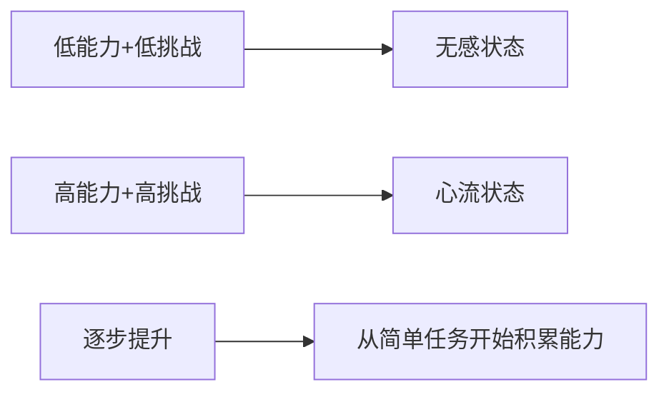

# 《成功者的大脑》 张爽解读

## 可视化总结

错误：xxxxxxxxxxx

## 内容总结

```ad-think
好的，我现在需要处理用户提供的关于《成功者的大脑》这本书的详细内容，并生成一个符合要求的回答。首先，用户已经给出了书的作者、核心内容以及各部分的详细解读，包括动机、复原力和情绪平衡三个主要成功要素。用户可能希望得到一个结构化的总结，或者更深入的分析，也可能想了解如何应用这些方法到实际生活中。

首先，我需要确认用户的需求。用户提供了大量的文本，看起来像是书籍的解读稿，可能希望将其整理成一个更简洁、结构清晰的摘要，或者得到关于如何应用这些心理学方法的建议。用户可能是学习者、自我提升爱好者，或者希望了解这本书核心观点的读者。

接下来，我需要按照用户提供的指南来构建回答。根据要求，需要使用中文，保持专业和口语化的平衡，分点结构，使用markdown格式，并且包含内部思考过程。同时，要确保回答符合DeepSeek-R1的身份，不涉及违法内容，保护隐私，并遵循公司政策。

用户的内容已经涵盖了三个主要部分：动机、复原力、情绪平衡，每个部分都有详细的解释和方法。我的任务是将这些信息提炼出来，可能还需要补充一些应用实例或进一步解释某些概念，比如“耶克斯-多德森定律”或“心流状态”，以确保读者完全理解。

需要注意用户的原文中可能存在的重复或冗余信息，需要进行精简。例如，关于动机的三段式循环，用户已经详细解释了每个阶段，可以将其归纳为更简洁的步骤。同时，确保每个成功要素的结构一致，先定义，再解释产生机制，最后给出实践方法。

还需要检查是否有遗漏的关键点，比如用户提到的其他五个成功要素（自我意识、专注、记忆、适应性和关爱大脑），虽然用户没有详细展开，但可能需要提及，以保持完整性。

最后，确保回答符合格式要求，使用适当的标题、子标题和列表，使内容易于阅读。同时，在思考过程中使用
```

标签，而在最终回答中使用规范的markdown格式。
</think>

# 《成功者的大脑》核心解读

## 作者简介

- **杰夫·布朗**：哈佛大学心理学家，专注大脑调节与积极心理学
- **马克·芬斯克**：加拿大圭尔夫大学心理学副教授
- **莉斯·内伯伦特**：健康题材畅销书作家

## 核心成功要素解析

### 一、动机：成功的内驱引擎

#### 动机三段式循环

1. **路径规划**（GPS定位）：设定明确目标（如中岛孝志的"4点起床"计划）
2. **激发阶段**（加油门）：通过外部回报法强化动力（如购买小号衣服激励减肥）
3. **行驶阶段**（前进执行）：达成心流状态（能力与挑战高度匹配）

#### 心流状态达成公式



### 二、复原力：逆境反弹力

#### 人格类型对比

| 人格类型 | 归因方式 | 复原表现 |
|---------|---------|---------|
| 内控人格 | 自我主导（如特里萨·梅里） | 快速复原 |
| 外控人格 | 归咎外界 | 易受挫败 |

#### 培养方法

1. **小事突破法**：从可控小事建立信心（如主动投简历替代被动等待）
2. **偶像镜像法**：激活镜像神经元模仿成功者应对策略

### 三、情绪平衡：最佳唤醒状态

#### 耶克斯-多德森定律

```mermaid
graph TD
A[简单任务] --> 高唤醒（紧张认真）
B[复杂任务] --> 低唤醒（冷静专注）
C[倒U曲线] --> 中等唤醒=最佳表现
```

#### 实践工具

1. **情绪日志**：连续14天记录情绪波动（0-10分制）
2. **书挡法**：隔离干扰专注当下（如奥运选手克里·斯特鲁格的赛场策略）

## 其他成功要素概览

- **自我意识**：准确认知自身优劣势
- **专注力**：排除干扰的持续注意力
- **记忆优化**：有效信息存储与提取
- **适应性**：快速应对环境变化
- **脑健康维护**：生理基础的养护策略

## 实践建议

1. **目标拆解**：将宏大目标分解为可操作的"心流单元"
2. **情绪校准**：根据任务难度调整唤醒水平（考试前冥想 vs 面试准备时适度紧张）
3. **镜像训练**：建立自己的"成功者应对案例库"

通过系统训练这三个核心要素，配合其他五个辅助要素的协同发展，普通人也能逐步构建起"成功者大脑"的神经连接模式。值得注意的是，书中强调的并非天赋决定论，而是通过科学方法实现神经可塑性改变，这正是本书区别于普通成功学著作的核心价值。

## 修复文案

关于作者

杰夫·布朗，哈佛大学的心理学家，主要教人们运用有效的技巧调节大脑，过上积极乐观的生活。

马克·芬斯克，加拿大圭尔夫大学心理学副教授。

莉斯·内伯伦特，健康题材畅销书作家。

关于本书

这是一本心理学书籍，它总结出成功者大脑中都具有的相同成功要素，以及培养这些成功要素的方法，让成功变得可以复制。

核心内容

第一部分，动机是什么，动机的产生过程以及如何完成动机三段式的正向循环。第二部分，复原力，明确什么是控制点，判断自己是内控人格还是外控人格，以及培养复原力的两种方法。第三部分，情绪平衡，通过耶克斯-多德森定律明白情绪唤醒水平和任务完成情况之间的关系，并找到让情绪达到最佳状态的方法。


你好，欢迎每天听本书，今天为你解读的书是《成功者的大脑》，这本书的中文版大约20万字，我会用大概25分钟的时间来说说这本书的精髓，成功者的大脑中有哪些相同的成功要素，以及培养出这些成功要素的方法。

在我们过去的认知里，一个人能成功，是很多因素综合作用的结果，比如智商、生活环境、经济基础和人脉等等，最重要的是，还需要一点点运气。

但这本书提出了一个观点：每一个成功者都有相似的大脑结构，他们只是更善于利用大脑中的某些特性，最大限度地发挥了大脑的潜能，最终帮助他们获得了成功。

这本书的作者有三位，分别是杰夫·布朗、马克·芬斯克和莉斯·内伯伦特。他们都是心理学方面的专家。我们重点说说杰夫·布朗这个人，他是哈佛大学的心理学家，主要教人们运用有效的技巧调节大脑，过上积极乐观的生活。他的很多心理学见解被多家知名媒体报道过，包括《纽约时报》《华尔街日报》《波士顿环球报》《创业家》等。这本《成功者的大脑》是布朗最畅销的书之一，已经在多个国家出版。

在这本书中，作者研究了大量真实案例，总结出成功者大脑中，有8个相同的成功要素，其中，最主要的三个分别是动机、复原力和情绪平衡。今天，我们就主要从这3个方面来讲讲如何打造成功者大脑。

我们先来讲讲第一个成功要素——动机。动机是培养成功的内驱力，它帮助成功者设法应对挑战。

你可能会问，那到底什么是动机？它对于完成一件事情真的有那么重要吗？动机，在心理学上一般被认为涉及行为的发端、方向、强度和持续性。说白了就是你想做某件事的念头。听概念可能有点不太好理解，我举个例子你就明白了。

日本有一个作家叫做中岛孝志，他写过一本书叫做《4点起床》，讲的是他坚持每天凌晨4点起床工作的故事，而且一坚持就是好几年。这种坚持行为让很多人佩服，也让很多人心中产生了这样的疑问：他为什么要4点起床呢？这是发端和方向。为什么要求自己每天坚持呢？这是强度。为什么他能把这件事连续做好几年呢？这是持续性。你看，这些问题其实就可以用一个词来解释，那就是动机。

那你可能又会问了，难道动机是自己产生的吗？当然不是，大多数人一定会有这样的经历，有时你起床醒来，会发现某一天你的状态特别好，好像有满满动力在你体内。于是，你决定把今天的行动列成清单，然后一个一个去完成。但好像这种时刻并不是经常发生，一个月当中，我们有强烈动机想要做完某事的天数也就那么几天而已。

那动机到底是如何产生的呢？作者把动机流经大脑的过程叫做“动机三段式”，也就是说动机并不是忽然闪现在脑海中的，而是分为3个阶段的递进过程。

第一阶段叫做“路线规划”阶段，你可以把它想象成我们开车去旅行时的地图，你可以在地图中找到你的目的地以及路线规划。有了这个阶段，就相当于你给自己的大脑安装了一个 GPS，你的目标就会在脑海里像 GPS 的红点一样闪烁不停。一旦锁定目标之后，大脑便进入了动机的第二个阶段，叫做“激发阶段”。此时，目的地已经被输入到你神经系统的 GPS 中，你已经知道了终点在哪儿，接下来，就是给油门了。“激发阶段”就相当于“给油门”，虽然还没开始行动，但此时，你已经有强大的意愿准备出发了。动机的最后一个阶段是“行驶阶段”。这很好理解，GPS 定位成功，油也已经加满，你也知道要去哪里旅行了，最后要做的就是前进行驶了。

再说回刚才讲到的日本作家坚持每天4点起床的例子，在产生这个行为之前，他一定是在脑海里给自己设置了一个明确的目标，然后他会在脑子里不断去想我应该如何完成这个目标？要持续做多久？最后落实到行动上之后，就完成了动机产生的正向循环。

这三个阶段听起来不难，但实际上很少人能做到。因为无论是路线规划、激发还是行驶阶段，完成其中一个阶段并不难，最难的是完成动机的正向循环。成功者大脑和普通人大脑的区别就在于，成功者非常善于一次又一次地启动这个正向循环，直到开始行动实现目标。而普通人的大脑经常会停在线路的某处，比如光有目标，动力不足，或者行动跟不上等等。

那如何才能完成动机的正向循环呢？作者介绍了一种方法，叫做“外部回报法”。比如，你想减肥，那就先给自己买一件小两个号的衣服挂在衣柜里，而且越贵越好。它会带给你动力，帮助你完成动机的“激发阶段”，让你每次看到它时都会想减肥。这样你就很快从激发阶段过渡到了行驶阶段。

那是不是顺利进入行驶阶段就完成了动机的正向循环呢？并不是。虽然都是行动，但是成功者行动的质量和普通人也是有区别的。就比如同样是1小时阅读，有些人就能完全专注沉浸在阅读中，收获想要的知识，而有些人也花了1小时的时间，却什么都没记住。

应该怎么办呢？成功者会让自己在行动中尽量达到一种“心流”状态，这是一种完全沉浸并高度投入的状态。达到心流状态时，人们甚至可以忘记时间和空间的存在。你也一定会有这样的体验，当你完全沉浸在一项工作中时你会发现时间过得很快，有时甚至忘了吃饭。

那么心流是如何产生的呢？研究人员认为，要看个人能力和这个事挑战难度的匹配程度。具体说就是，只有当能力高、挑战难度也高的情况下，才会产生心流。如果能力与挑战难度都比较低，即使它们是匹配的，也不属于心流状态，而属于一种无感状态。比如洗衣服对于成年人来说，就属于无感状态。这种状态也比较舒适，比无聊、焦虑要好。

那要产生心流的话，需要自己的能力与要做事情的挑战难度都比较高，这两个因素还要匹配。这就会出现两种情况：一方面，你的能力已经很高了，这个时候非常简单，你只需要去做那些与自己能力相当的事情就可以达到心流状态。另一方面，你的能力比较低，这个时候，你是不具备获得心流的先决条件的。这时你可以做的是，首先保持自己在无感状态里，也就是做那些挑战难度比较低的事，直到熟练掌握了做简单事情的技巧，这时候你的能力可能就已经提高了，然后再提高难度。用这种方式，一步一步地逐渐提升你的能力与挑战难度，直到能力与挑战难度都进入了较高的水平，这样就可以达到心流的状态了。

比如，你的目标是写一本书，不要只是想着在书店里看到自己的作品，而是要把与写书有关的所有任务都列出来。你可以与写书的朋友聊一聊，了解写书的过程，接下来，你可以列出书的提纲，看一些同类型的书等等。这样不断去实现一个小目标，最终可能就会实现大目标。

我们来总结一下动机这个成功要素，动机的产生包括三个阶段，也叫作“动机三段式”，分别是：路径规划阶段、激发阶段和行驶阶段。通过外部回报法产生助推力，可以帮助我们完成从激发阶段到行驶阶段的过渡。如果想要完成高质量的行驶阶段，可以通过专注步骤而不是结果的方法，让自己达到心流状态，从而完成动机的正向循环。

对于成功者来说，光有动机是不够的，我们经常会发现，有时候我们拥有强烈的动机想要做一件事时，现实总会过来泼冷水，把我们打回原形。接下来，我们就来讲讲当外界环境将我们击败时，成功者所需要具备的另一个非常重要的成功要素——复原力。

每个人的生活里，都充满了各种各样的逆境、挫折和打击。但为什么有些人在困难面前一蹶不振？而有些人却能历经千难万苦也从不畏缩和动摇？答案就在于后者具有复原力。

那么，能使人们渡过难关的复原力到底是什么呢？心理学中是这么解释复原力的：一个人如果能够在不良的环境下，面对各种变化，克服各种压力，从逆境和挫折中恢复过来，维持正常生活。这种能力就叫作复原力。

你可以把它想象成弹簧，无论外界给出多少压力，这种能力总是有力量让你复原到最开始的状态。成功者的大脑里，储备了很多“复原力”，他们跌倒后爬起来的次数总是比其他人多一次。

书中讲述了一个真实故事，这个故事曾在全美国媒体头版头条中报道过。1989年，名叫特里萨·梅里的小女孩在中央公园慢跑时发生了一件可怕的事情。在横穿公园的路上，她遭到了野蛮袭击和强暴，身体失去了约75%的血液，头部受到重创，几乎丧命。后来她被好心人发现送去了医院，尽管生存的希望非常渺茫，她最终还是从昏迷和精神错乱中挺了过来。这种事情如果发生在其他人身上，也许会让一个人一辈子都活在恐惧的阴影下，但梅里没有，她成功地从致命的打击中走了出来，用强大的复原力让自己回到了正常的生活轨道中，最后成了一名励志演讲家。

当生活遇到严重打击时，往往会出现两种结果，第一种被灾难压垮，再也振作不起来。但也有另外一种人，他们并不会因为外界的环境而打乱自己的选择，无论受到再大的打击，他们总是能让自己迅速复原。就像上面故事中被袭击的梅里。

为什么他们会具备复原力呢？作者提出了一个概念叫“控制点”，就是人们对生活中发生的好事和坏事的归因方法。也就是说，在这个临界点上，你可以有两种选择，第一种，就是把你的遭遇全部归因于外部原因，作者管这种人叫做“外控人格”，外控人相信事件之所以会发生，是因为外部力量的作用，比如环境、其他人或者命运，反正自己所能做得非常有限。跟它相对的是“内控人格”，具备这种人格的人恰好相反，他们相信自己可以主宰自己的命运，不会把结果归因到外部环境中。

作者认为，拥有“内控人格”的人有更多的复原能力让自己从失败中解脱出来，积蓄动力迎接更大的挑战。你也许会问“那如果一个人是‘外控人格’，岂不是失败后就永远一蹶不振了？”作者建议，如果你是“外控人格”，你可以通过完成一些小事来改变自己的世界观。

比如，你失业了，你既可以选择坐等工作机会找上门来，也可以主动把简历提交给所有潜在雇主。比如，你高考没考上理想的学校，你可以选择懊悔自责，或者抱怨命运不好，也可以接受现实，想想如何更有意义地度过大学生活。再比如，你正经历一段失败的婚姻关系，你可以选择吵闹和抱怨，也可以主动处理这段糟糕的关系，开始新的生活。总之，在这种小的选择上，让自己刻意去尝试选择积极的方法去完成它，一旦你在控制小事上获得了信心，你就能够以更负责的态度来应对生活中更大的挑战了。

除了在小事上改变自己的世界观，作者还介绍了一种培养复原力的方法，叫做“寻找应对失败的楷模”。说得简单些，就是看别人是怎么应对失败的。当面临糟糕的状况时，你可以问自己：“我最喜欢的教授、老板、偶像、朋友会怎么做？”然后，假装你成为了他们，借助他人的思想和应对资源来帮助自己度过最糟糕的时期。也许你听起来有些不切实际，但这种方法被证明非常有效，因为我们脑细胞网络中有一种专门负责“有样学样”的脑细胞，叫作镜像神经元，它能够提供一种对他人的内在模仿，帮助你更好地理解他人的行为、意图和情绪。借助他人的力量帮助自己复原。

我们来总结下复原力这个成功要素，在这一部分，我们讲了复原力在生活中遇到困难时的重要作用，以及内控人格和外控人格在控制点所做出的两种截然不同的选择。对于外控人格的人，我们可以通过完成小事来改变世界观的方法获得信心，也可以通过模仿偶像借助他人的思想和应对资源来帮助自己复原。

我们知道，一个人要从巨大的创伤中走出来，除了要有复原力，更重要的是情绪的力量。无论你正在经历麻烦的离婚、还是突然被炒了鱿鱼，情绪可以让你的复原力发挥得更好。成功者大脑的第三个共同因素，就是情绪平衡。

我们经常会发现这样的现象，成功人士好像永远充满斗志，他们能够合理安排时间，完成目标，而普通人却普遍比较懒散。这背后的原因，除了我们刚才讲到的动机因素外，情绪也起着巨大的作用，对于每一种情境来说，都存在一个最佳的情绪状态和最佳情绪量，成功者总能将自己的情绪唤起到最佳的情绪状态，而情绪唤起水平和任务完成之间存在着一种规律。心理学中管这条规律叫作“耶克斯-多德森定律”。耶克斯和多德森分别是两位哈佛心理学家的名字，他们最先发现了这种关系，所以为了纪念他们，就以他们的名字来命名这个定律。

那什么叫唤醒水平呢？就是你身体内的应激代谢水平，俗话说就是你够不够High，唤醒水平和人的情绪状态是密切相关的。可以想象，当一个人极度恐惧或极度高兴时，唤醒水平自然会很高，人就会睡不着觉，不能淡定；相反，当一个人处于淡淡的忧伤或满足时，唤醒水平就会比较低，也不利于任务的完成。在耶克斯—多德森定律说，各种活动都存在一个最佳的情绪唤起状态。如果情绪唤起不足或者过分强烈，都会使工作效率下降。

这可能有一点难理解，我们不妨用图形的方式来讲一下，这样你可以有一个直观的概念。想象一下，这里有一个平面坐标系，横轴代表情绪唤起程度，纵轴代表任务完成情况，它们的关系不是一种线性关系，而是有点像抛物线一样的倒U形曲线。也就是说，情绪量不多不少处于中等水平时，任务完成情况才会达到峰值，一旦你的情绪量超过了这个水平，对任务完成反而会产生一定的阻碍作用。

比如有句成语叫作得意忘形，其实说的就是这个定律。当人在十分得意的时候，唤醒水平较高，在完成任务时绩效较低，表现出的现象可能就是容易出错。

这个定律还可以用来解释，为什么有的孩子平时学习非常好，但是一到考试中就“怯场”发挥失常。因为高的情绪唤起会带来低的任务完成情况，所以在考试中，孩子们焦虑、紧张，就是唤起了较高的情绪水平，这会干扰记忆和思维活动，降低效率，所以他们即使在平时学习很好，考试中也很难发挥出真实水平。

但是，一味地保持较低的唤醒水平也不行，有的场合还需要让自己兴奋一点。那到底什么场合要唤起高的情绪水平，什么场合又需要低的情绪水平呢？作者认为，要看任务的难度。对于容易或简单的任务，较高的唤醒水平会利于完成。对于困难或复杂的工作，较低的唤醒水平是最好的。中度的唤醒水平对中等难度的任务最适用。那什么样的任务是简单的？什么样的任务是困难的呢？这里并没有一个标准答案，要根据你自己对这件事情的驾驭程度来判断，比如，你是一个很少参加面试的人，那么，面试这件事对你来说就属于困难任务，这时，较低的情绪唤醒水平对你就是有利的，也就是说放松、平和这种情绪才会让你发挥更好。而相比于面试，做简历这件事就属于简单且容易的任务，在这种任务上，你就需要主动调动高情绪唤醒水平，让自己稍微紧张些对待它，这样你就会更认真对待这份简历。简单总结就是：根据自己的能力判断事情的难易程度，小事多用心，正事用点心，大事放宽心。

所以，如果我们模仿成功者的大脑，首先要学会的就是调节自己的情绪唤起水平，根据自己的实际能力和目标的相对难度来确定，情绪唤起水平应该高一点还是低一点。

那应该怎么办呢？先得学会了解自我。作者建议，可以记录一到两周的情绪日志，来找到自己的情绪反应范围。你可以每天睡前给自己一整天的情绪进行打分，最高10分，特别开心打10分，十分沮丧打0分，然后根据程度不同上下浮动。然后在坐标轴上画下一个个点，把你在2周内的情绪点连成线，这样你就更加清楚你自己的情绪底线在哪里了，也能比较直观地看到自己的情绪波动范围。包括什么事情让你的情绪变得高涨，什么事情让你的情绪变得低落。紧接着，试着判断出自己比较容易表达什么情绪，又有哪些情绪很难表达出来，你更擅长表达快乐，还是悲伤？更擅长表达满意，还是愤怒？等等。掌握了自己的情绪变化规律之后，你就会在特殊时刻更容易调整自己的情绪唤起水平，调整出自己的最佳状态。

这个时候你也许会问，万一我记录2周下来，情绪状态都很低怎么办呢？了解自己的情绪状态之后该如何管理情绪呢？书中给出了一个有效的管理情绪方法叫做“书挡”法。这个词很好理解，你可以想象一个杂乱的办公桌上成堆地摆放着各种文件，这时，你用一个书挡把这些文件和当下的任务隔开，就会减轻你所承受的压力和焦虑。

你可能会说“这不就是眼不见心不烦吗？”并不是，“书挡”法并不是让你逃避问题，而是将“现在”这样的词作为“书挡”，把过去和未来区隔开来，你只专注在现在的事情上，等完成当前的事情后，你再把书挡拿开，把过去的事情处理掉。

举个例子，在1996年的奥运会上，美国体操运动员克里·斯特鲁格在跳马比赛的第一跳中扭伤了脚踝，观众都发出了唏嘘声，为她担忧，但她却并没有陷入当时的情境中，而是给自己设立了一个“书挡”，把一切压力阻隔在外面，只关注一个可以控制的任务，那就是第二跳的技术动作。她说：“我没有听到观众的反应，也没有想自己的脚踝或者我的成败意味着什么，我只专注于自己的表现。”最终，她在第一跳受伤的情况下，依然取得了第二跳的成功，帮助美国体操队赢得了女子体操团体冠军。

所以，当压力过大或者焦虑情绪爆棚时，我们可以在大脑中给那些事情设立一个“书挡”，只让自己专注于可以控制的任务中，当你完成了一个可控任务后，你的情绪唤起水平会相对升高，这时再去面对其他任务，就更容易进行下去了。

在这一部分里，对于情绪平衡，我们讲了耶克斯—多德森定律，过高或者过低的情绪唤起水平对于任务完成来说都是不利的，我们可以通过记录情绪日志的方式了解自我，找到自己情绪的最佳状态和最佳情绪量。当情绪无法控制时，在大脑中设个“书挡”，让自己专注在目前可以控制的事情上，完成一项任务后再把“书挡”拿开，去处理其他任务。

最后，我们来总结下这本书的所有内容。

我们介绍了成功者大脑中的3个主要成功要素，第一个是动机，动机的产生分为三个阶段：分别是路径规划阶段、激发阶段和行驶阶段。通过外部回报法和专注步骤获得心流法，可以帮助我们完成激发阶段和行驶阶段。第二个是复原力，内控人格和外控人格在控制点有两种不同反应。外控人格想要培养复原力，可以通过完成小事改变世界观的方法增加信心，也可以模仿偶像，借助他人的思想和资源。最后一个是情绪平衡，我们需要调节自己的情绪到最佳情绪量。除此之外，可以通过记录情绪日志的方法来了解自己，也可以通过“书挡”法，让自己专注在可控的事情上，来管理情绪。

在书中，除了动机、复原力、情绪平衡这3个主要成功要素外，作者还介绍了其他5个成功要素，分别是自我意识、专注、记忆、适应性和关爱大脑。作者认为，通过有意识地锻炼，我们也可以改变脑神经的连接，让自己的大脑更积极，帮助我们走向成功。

撰稿：张爽
脑图：摩西
转述：成亚