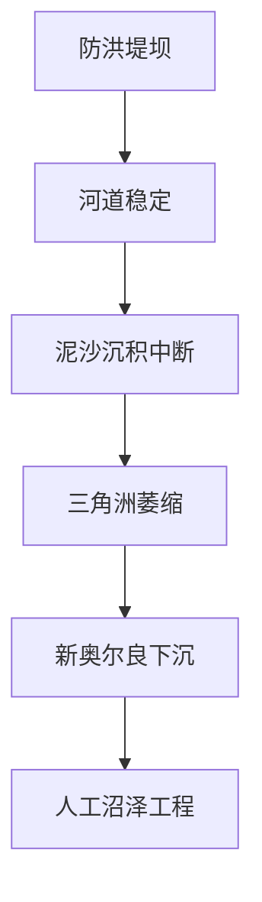
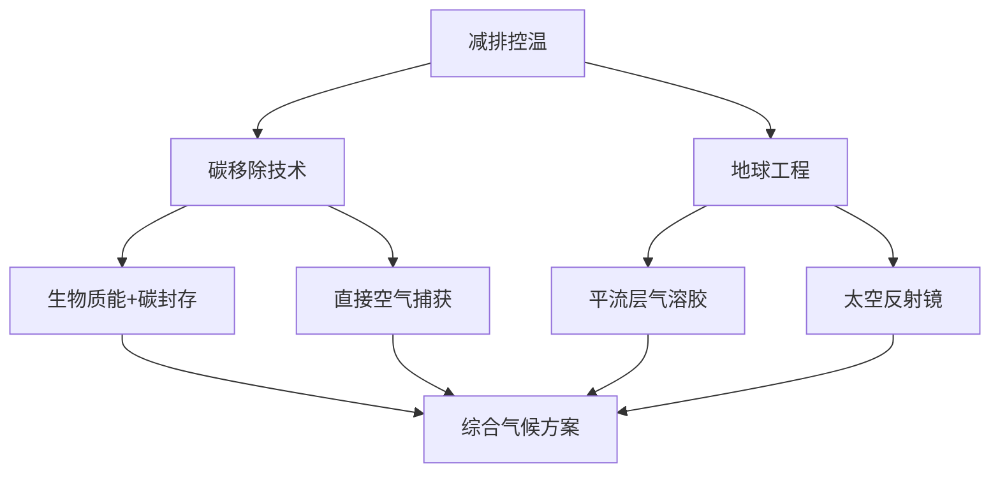

# 《白色天空下》王朝解读

## 可视化总结

错误：xxxxxxxxxxx

## 内容总结

```ad-think
嗯，用户提供了一段关于《白色天空下》这本书的详细解读，内容涉及地球工程、自然干预的案例以及人类与自然的关系。首先，我需要理解用户的需求，可能是在寻找对这本书的总结或深入分析，或者希望得到对其中提到的地球工程和自然干预案例的进一步解释。用户可能对气候变化、环境保护感兴趣，或者想了解人类干预自然带来的后果。

接下来，我需要确定用户可能的深层需求。他们可能希望了解地球工程的技术细节，或者这些案例背后的科学原理，也可能想探讨人类在自然干预中的伦理问题。此外，用户可能对书中提到的具体案例，如密西西比河治理、亚洲鲤鱼入侵、超级珊瑚计划等，有进一步的好奇。

用户提供的文本结构清晰，分为多个部分，包括地球工程的定义、案例分析和结论。我需要确保回应涵盖这些部分，并强调关键点，如地球工程的两类方法（太阳能辐射管理和碳移除）、具体案例的教训（如干预的不可预见后果），以及作者的核心观点——人类干预既是问题也是解决方案。

同时，用户可能希望了解这些案例的现实意义，比如当前的气候变化应对措施，或者科技在环境保护中的作用。需要指出书中提到的技术现状，如碳捕获项目的进展，以及面临的挑战，如技术可行性和伦理争议。

最后，用户可能希望得到对书中观点的总结，强调人类与自然关系的复杂性，以及未来应采取的策略，如综合减排、碳移除和地球工程。需要确保回应逻辑清晰，结构合理，使用适当的术语，同时保持易懂，避免过于学术化。
```

### 《白色天空下》：人类干预自然的困境与反思

#### **核心问题：自然工程的双刃剑效应**

人类对自然的干预往往始于解决既有问题，却常引发新危机，形成"干预套娃"。从密西西比河治理到气候工程，本书揭示了人类在控制自然过程中面临的复杂挑战。

#### **关键概念解析**

1. **地球工程两大路径**
   - **太阳能辐射管理**：通过平流层气溶胶注入（如硫酸盐颗粒）反射阳光，成本低但风险高（如1816年"无夏之年"的火山降温启示）
   - **碳移除工程**：包括生物质能+碳捕获（如中国毛乌素电厂）、直接空气捕获（冰岛"气候修造"项目）等技术，目前规模有限但发展迅速

2. **典型案例警示**
   - **密西西比河悖论**：



   - **生物入侵循环**：
   - 为环保引进亚洲鲤鱼→生态灾难→电击屏障→新的人为干预
   - 澳大利亚引入海蟾蜍治虫→本土物种灭绝→基因编辑应对

4. **技术突破尝试**
   - **超级珊瑚计划**：通过实验室筛选耐高温/酸藻类，实现珊瑚"辅助进化"
   - **基因工程应用**：编辑海蟾蜍毒性基因，改变鼠类性别比例控制种群

#### **数据警示**

- 2023年全球升温或突破1.5℃临界点（欧盟哥白尼气候变化中心）
- 大堡礁预计2050年全灭（珊瑚白化研究）
- 美国亚洲鲤鱼占比达97%的流域（生态监测数据）

#### **哲学反思**

5. **干预悖论**：自然工程既是人类技术自信的体现，也是对既往破坏的补救
6. **责任困境**：当"不作为"代价更大时，如何选择最小伤害路径？
7. **新自然观**：现代"自然"已深度人化，需建立动态平衡的生态管理思维

#### **行动框架**



#### **未来挑战**

- 技术可行性：冰岛碳封存项目因设备冻损暂停的启示
- 规模瓶颈：当前碳移除量仅相当于5000中国人年排放量
- 伦理争议：谁有权决定全球天空颜色？地缘政治风险几何？

本书最终指向一个深刻悖论：人类既是地球的破坏者，也是唯一有能力修复它的物种。在"白色天空"的隐喻下，我们需要的不仅是技术创新，更是对自然-人类关系的根本性反思。

## 修复文案


你好，欢迎每天听本书。

今天这本书的标题有点奇怪，《白色天空下》，天空不是蓝的吗？怎么是白色的？这其实说的是一个非常宏大，但也有点吓人的工程，要把硫酸盐、钻石或者碳酸钙之类的粉末发射到高空几十公里的平流层上，改变大气层的反光率，将天空从蓝色变成白色，这样就能遮蔽部分太阳光，减缓甚至逆转地球变暖。

实际上，“白色天空”只是众多“地球工程”之一。“地球工程”是一个统称，2009年首次由英国皇家学会提出定义，它也可以叫人为气候干预，特指以减少或抵消气候变化造成的升温为目的的一系列技术。其他地球工程还有往极地的天空发射非常微小的盐水水滴、用太空镜片反射走太阳光等等，就算撇开经济成本不提，你也应该会想到，地球工程并不只是简单的降温，还会有难以预知的副作用。比如会不会威胁粮食安全，释放颗粒会不会影响呼吸系统，硫酸盐颗粒会不会造成大规模酸雨等等。

为什么科学家要冒着这么大的危险，去干预大自然呢？原因很简单，危机迫在眉睫。2023年全球升温幅度极有可能打破2016年创造的纪录，成为1850年以来最暖的年份。根据欧盟哥白尼气候变化服务中心的报告，2023年7月不但是全球有记录以来最热的月份，还是首次全球平均气温比基准气温上升1.5℃。这个1.5摄氏度的温度阈值，被科学家们认为是一个关键临界点，一旦年度升温超过这个阈值，极端高温、洪水、干旱、野火等灾害将会大幅增加，地球气候系统将会走向混乱甚至崩溃。在这个节骨眼上，人类必须为自己造出的危机想出一个解决办法，而除了最简单的节能减排，想要更立竿见影地改变气候变化的趋势，就只能发挥想象力，更深入地干预自然了。

不过，这本书讲的不仅仅局限于把天空变白的“地球工程”，而是讲述了几十年来人类的各种大型工程，既有物种级别的，也有全球级别的。有些技术很先进，有些手段很粗暴，从美国水利工程和亚洲鲤鱼斗智斗勇，到治理密西西比河造成新奥尔良逐渐被淹没；从提着水桶挽救濒危鱼类，到通过基因工程培育能够承受极端气候的“超级珊瑚”，为我们展现了人类在试图驯服自然的过程中弄巧成拙，为了挽回破坏，恢复自然，不得不亡羊补牢，继续干预自然的一些历史事件。

这本书的作者伊丽莎白·科尔伯特是美国知名记者、优秀科普作家，听书之前曾经解读过她的普利策奖获奖作品《大灭绝时代》。在《大灭绝时代》展现了人类所面对的自然危机后，科尔伯特转向了我们能采取什么行动，和这些行动会有什么样的后果。她通过翔实的调查告诉我们，人类对自然的影响已经不可能走回头路，干预自然是我们最危险的尝试，也是最后的希望。而今天这本书所梳理的，就是人类在自然工程的历史上，怎么屡战屡败，而又屡败屡战的。

我将把本书分成几个问题，为你展现人类在控制自然上的各种努力，以及对自然的控制如何导向了更多的控制。我们首先从“地球工程”开始，来更深入地了解那样的超级干预工程是什么，然后结合美国密西西比河和五大湖区的历史案例，说说为什么没有完全成功的干预。不过人类并不是毫无希望，干预也有接近成功的时候，看看作者举出的哪些生物工程案例既能够改善濒危物种的生存，又能控制入侵物种的破坏。最后，我们再回到“白色天空”，了解最前沿、最狂野的气候工程技术。

我们刚刚简单地提了一下，什么是地球工程，这里再具体展开说说。地球工程一般分为两类，一类是太阳能辐射管理，也就是像白色天空这样的，对太阳辐射进行控制，还有一类是碳移除工程，也就是用人工手段从大气中捕获造成温室效应的二氧化碳，实现碳的负排放。

碳移除工程实际上已经开始了一些实验性项目，比如生物能结合碳捕获与封存技术，听起来有点复杂，其实中国就有一个例子，它就是位于内蒙古的毛乌素生物质电厂。我们结合这个中国的例子来讲解这个生物碳移除的原理，其实很简单。毛乌素生物质电厂就是种能够固沙的沙柳，然后用沙柳燃烧发电，每次要砍沙柳的时候，必须种一株新的来替代。那你肯定要问了，这不还是火力发电吗？形式的确很像，但是性质已经完全不同了。首先，传统的火力发电是用不可再生的化石能源，比如煤炭，而生物质电厂使用的是可再生的植物，并且靠植物的光合作用从大气中捕获碳。第二，也是最重要的差异，就是在燃烧之后采用先进的技术手段，把燃烧生成的二氧化碳再“捕获”并封存起来。毛乌素电站的做法比较聪明，把发电的草木灰和高纯度二氧化碳尾气，用来种植螺旋藻，既赚了螺旋藻的钱，又让螺旋藻在生长过程中进一步吸收碳。还有一些其他的做法是把尾气收集后直接液化，封存到地下。还有类似思路的“以竹代塑”，也是用植物取代化石燃料产物。很多人没有意识到，其实很多塑料都需要用化石燃料来合成基本成分，会增加碳排放，而竹子则可以捕获大气中的二氧化碳。

除了这种利用自然生物的碳移除工程，也有更加科幻的技术方案。比如作者科尔伯特就参加了一个把二氧化碳变成石头的初创企业，叫“气候修造”。几年前，她收到这家科技公司的推销邮件，听起来很像诈骗，说是如果你为全球气候变暖而担忧，每年交一些钱，就能把二氧化碳从空气中清理出来，埋入地下八百米深处。科尔伯特抱着试试看的心态，就决定签约了。就这么过了一年，她决定亲自去现场检查一下到底有没有被骗。

作者去的是他们位于冰岛的一座地热电厂，这个发电厂计划“让清洁能源变得更清洁”，已经投入使用。这座电厂和普通地热电厂一样，利用火山的地热烧水，不一样的是，他们把火山释放出的温室气体注入水池中，做成一种高压气泡水，灌进地下。在地层深处，二氧化碳会在水中和火山岩重新反应变成矿物质。而气候修造的项目就在电厂旁边，一座像火箭发射平台一样的机器会直接吸入空气，用一种特殊物质捕捉二氧化碳分子，再通过加热释放二氧化碳分子，和电厂的气泡水混合。事实上，二氧化碳本来就会被大自然吸收，变成矿物，但是这种自然过程需要几十万年，而气候修造的项目将这个过程加快到了几个月之内。从电厂地下几百米深处挖上来的深色玄武岩上，作者已经可以看见一块块白色的固体，代表着人类碳排放的痕迹。

关于这个项目，我也做了一些了解，发现气候修造公司在作者访问几个月后就暂停运作了，因为他们的机器无法耐受冰岛当地的严寒，冻坏了。还好，这个项目没有真的骗钱跑路，包括微软公司在内的投资方继续支持他们改进技术，实现未来三年内吸收四万吨二氧化碳的目标。按2022年的中国人均碳排放水平计算，这个数字大约相当于五千个中国人一年的碳排放量，虽然对于全球来说只是杯水车薪，但也是重要的一小步。

但是，也有人认为碳移除工程还不能被称为地球工程，因为碳移除工程的规模还没有达到“地球”级别，比如刚刚提到的就是一个发电厂的范围。而像太阳能辐射控制的方案，要么就是向极地天空喷射盐水，要么就是发射巨型太空镜子，规模达不到全球，也至少有地区规模。

但科尔伯特提醒我们，如果不考虑宏大的规模，只是说试图用更深层次的人类干预来恢复自然的工程，地球工程其实并不罕见，只是一种极端案例。我们可以给包括地球工程的这一大类工程取一个新名字，叫“自然工程”。这种工程的目标是消除人为干预的破坏，让自然恢复原本的状态，但是手段却是要人类更进一步地干预自然。比如为了控制水利工程造成的三角洲退化，就是一个自然工程，而水利工程本身，就不是自然工程。

也就是说，地球工程这样的自然工程，就是要干预那些人类干预自然造成的结果，是一个干预的套娃。这正是这种工程的特点，它所应对的危机不是自然危机，而是人类造成的危机。

接下来，我们就来看两个经典的自然工程案例，一个在美国密西西比河三角洲，另一个也在美国，在五大湖区。

好，第一个案例非常经典，是人类驯服自然的意外副产品。你可能之前听说过，美国的密西西比河是北美最大的河流，也是世界第四长河，流域覆盖了全美国40%，比黄河流域还要大五分之一。但是密西西比河有一个很严重的问题，它的干流在美国大平原地区，从北向南奔流进墨西哥湾，中间几乎没有什么山脉约束这条狂暴的河流，而在人类干预以前，每年能有数亿吨的沉积物顺流而下。于是，在地球自转和堆积物的共同作用下，密西西比河和以前的黄河很像，形成了弯曲而多变的河道，很容易决堤泛滥。过去七千年间，密西西比河就发生了六次大决口，小的决口更是不计其数。以位于密西西比河三角洲的新奥尔良为例，1858年发生了45次决口，1882年甚至高达284次，全城每隔几十年就要被河水淹没一次。

美国人也知道，密西西比河两岸土地非常肥沃，本来应该是上好的农业基地，但因为长期泛滥而无法完全利用起来，得想个法子。于是，1879年美国在美国陆军工程兵属下设立了密西西比河委员会，拨款一百万美元，差不多相当于今天的一亿美元，让工程兵去驯服密西西比河这条巨蟒。他们的方式简单粗暴，直接在河岸筑起大堤，阻止河流变道。当时有科学家提醒，两岸筑堤并不能完全杜绝决口的可能性，反而还会增强洪水的破坏力，但是美国工程兵并没有当一回事。结果1926年，一场连绵不绝的大暴雨让密西西比河水位居高不下，最终到了1927年春天，洪水决堤，造成美国史上破坏最大的洪水。这场洪水淹没了上万平方公里的土地，造成数百万人流离失所，按今天的货币价值计算，损失高达70亿美元。

美国人痛定思痛，在1928年美国国会通过《洪水防控法》，再度要求工兵部队全面治理密西西比河。美国工兵不但新修了几百公里的堤坝，还加固了原有的河道大堤，平均每一座都增高了一米并扩大了一倍体积。而且这次工兵吃一堑长一智，不光靠堵，还学会了疏。由于有上百万人口的新奥尔良就在下游三角洲，不能直接行洪，美国工兵把密西西比河和旁边的几条河联通，修建了极其复杂的下游泄洪体系，在高峰时期的主要泄洪道流量相当于一条珠江。此后，密西西比河虽然也常有紧急泄洪，但再没有发生过大规模的洪水。美国工兵骄傲地宣称“我们治理了它，拉直了它，规整了它，禁锢了它”。

但是如果故事这么结束的话，就没有本书要探讨的问题了。结果密西西比河是治好了，密西西比河三角洲却开始出问题了。密西西比河是不决口了，但是沉积物也下不来了。原来新奥尔良所在的三角洲每年都会得到上游的泥沙补充，然而现在只有海水侵蚀，而没有补充，新奥尔良发生了严重的水土流失，两百万人居住的土地开始分崩离析。比如下游的查尔斯岛在几十年间就从90平方公里缩小到了1.3平方公里，假如你住在那里，小时候这个岛差不多就是北京的东西城区的大小，等你老了的时候就只剩下三个天安门广场那么大了。

现在的新奥尔良地势低洼，又是世界上沉降最快的地方之一，有些地区十年间下沉了15厘米，全城很多地方都降到了海平面之下。更糟的是从一百年前开始，新奥尔良就已经开始建设水泵系统，把周围的沼泽和湿地抽干，扩大城区建设，结果现在水越抽越多，城市下降得越来越快。下沉也使新奥尔良不得不继续加高海坝，以免重现2005年卡特里娜飓风造成的水灾，当时风暴带着海水淹没了80%的城区，有近两千人遇难。

为了阻止新奥尔良消失，自然工程必须不断加码。工兵们这一次的目标是重现被他们的前辈阻止的决口，恢复被抽干的沼泽。他们使用地下的钻头把沉积物翻到地面上，再用一个柴油泵和运输管将其运到几公里外的低洼地带，形成新的沼泽。每片人工沼泽造价高达数百万美元，每平方米价值8美元，总共规划了几十个。然而，如果钻头停转，水泵关闭，大概十年之后这些沼泽就会再度消失。在和密西西比河的较量之中，人类似乎就像西西弗斯一样不停重复推石头上山，每一次以为到了巅峰，就又要开始新一轮的工程。密西西比河告诉我们，被人类禁锢的是人类自己，而不是河流。

第二个案例，虽然也在美国，但是中国人会有一点点的亲切感。我们也还是从密西西比河开始，你猜猜密西西比河现在最多的鱼是什么？答案可能会让你有点惊讶，“亚洲鲤鱼”。不过，这个亚洲鲤鱼其实是一个统称，其中包括且不限于中国的“四大家鱼”，也就是鲤科的青鱼、草鱼、鳙鱼、鲢鱼。没错，“亚洲鲤鱼”就是来自亚洲的一系列鲤科鱼类的统称，美国人分不太清楚，就起了这么个名字。

这些鱼是怎么远渡重洋来到美国的呢？其实起因恰好就是为了保护环境。早在1962年，有一本书叫《寂静的春天》，警告人类滥用杀虫剂和化肥，最终会导致生态灾难，春天再也听不到鸟儿的歌唱，所以叫寂静的春天。这本书一发售就引起轰动，推动了环保运动的发展。当时美国人使用除草剂来对付一种入侵的水草，这种水草会堵塞河道，影响航行。《寂静的春天》出版之后，于是就有美国人寻思，如果我们不用除草剂，而是引进一种吃草的鱼，不就可以既保护生态，又解决水草了？1963年，美国鱼类和野生动物管理局第一次引进了草鱼，很快这些草鱼就逃逸到了密西西比河中，不久后，又有人引进了鲢鱼、鳙鱼来吃水草，结果也都无一例外逃到了密西西比河之中。

问题是，这些鲤科鱼类很快就会发现美国人不爱吃多刺的鱼，自己在北美没有天敌，又遍地都是饵料，就像欧洲人征服美洲，亚洲鲤鱼征服了美洲。只花了三十多年，亚洲鲤鱼就几乎统治了整片密西西比河流域。到今天，密西西比河的一些支流中有97%的鱼类都是亚洲鲤鱼，本土鱼种都成了珍稀物种，本地的淡水贻贝等软体生物也快被吃灭绝了。

有些河里的亚洲鲤鱼，不仅仅是生态灾难，都快让河流变得不适宜通航了。为什么？由于鲢鱼有被惊扰就跃出水面的习性，船的引擎声会让河道里的成百上千条鱼全部跳起来，直接撞到船上或者乘客身上。科尔伯特就有这样的经历，她坐着小船在河上，突然一条鲢鱼腾空而起，打中她的脑袋，感觉就像挨了一闷棍，还有村民描述自己曾直接被鱼打晕。

但更糟糕的是，这些鲤鱼还有入侵五大湖区的威胁。如果你比较熟悉地理，可能知道密西西比河和五大湖区按理说，是不相连的，为什么鲤鱼会威胁五大湖区呢？原来，当年芝加哥19世纪末改造市区排水系统时，逆转了芝加哥河的流向，让河流进了密西西比河的支流里。在那之前，芝加哥的城市污水都排入芝加哥河，然后进入密歇根湖，污染了芝加哥全市的水源，造成了瘟疫流行。改道之后，芝加哥的污水就顺流而下，排入密西西比河中。

但是到了九十年代，亚洲鲤鱼在密西西比河泛滥成灾，芝加哥的排水系统无心插柳，成了五大湖保卫战的前线。美国国会又一次找到负责治理密西西比河的工兵部队来解决问题。工兵的负责人告诉科尔伯特，当年国会说“做点什么都行”，于是他们除了直接派人抓鱼，还想了个简单粗暴的办法：电鱼。2002年，第一道电鱼屏障开始通电，和五大湖联通的整条河段中都有一点电场，鱼越大，电压差越大，越容易被电死，当然，人也容易被电死。而且，每次检修，还需要在河道内下毒，避免有漏网之鱼突破防线。他们还打算更新技术，改成耗资7亿美元的气泡闸门，用噪声击退入侵者。

当然，工兵们也研究了恢复原有流域分隔的方案，“只”需要25年和180亿美元，相比整个五大湖的生物资源来说的确很便宜。但是，芝加哥人不同意，既然只要自己家门口的河水通上电就行，为什么要多花钱呢？当然，他们还想了一个师夷长技以制夷的方案，搞鲤鱼饮食文化节之类的宣传措施，让美国人爱上吃鲤鱼。只不过到目前为止，效果看起来还是不如给河水通电。

问题来了，维护“自然状态”而被通电的那条河流，是不是自然的一部分呢？电死别的鱼怎么办呢？密西西比河与亚洲鲤鱼的案例告诉我们，人类的自然工程鲜有真正的成功案例，我们对自然世界知之甚少，又太急于干预，人类往往在自信地迈出干预自然的第一步之后，就已经失去了主动权。我们不得不面对现实，自然已经永久地改变了，没有人工干预维持的自然已经越来越少，我们需要思考自己的每一步，是不是真的值得。

刚刚说的案例都不太成功，科尔伯特说，也并不是每一个自然工程的前景都那么灰暗。在针对性很强的项目中，人类其实还是能看见胜利曙光的。她就访问了两个很有希望的工程，一个是拯救濒危物种，一个用来消灭入侵物种。

拯救濒危物种的工程，是一个叫“超级珊瑚”的计划。我们都知道，珊瑚礁就像海底的热带雨林。每一株小珊瑚其实都是几个物种的合作社，珊瑚虫会在体内“种植”一些共生藻类，靠这些藻类养活自己。但是由于海水变暖、二氧化碳比例升高造成的海水酸化、海洋污染等等多种人类因素的影响下，全世界的珊瑚礁都在萎缩。在不适宜的条件下，组成珊瑚的珊瑚虫会排出体内的共生藻类，失去藻类供养的珊瑚虫会慢慢饿死，色彩随着生命一同消亡，露出底下白色的珊瑚礁，也就是它们的石灰质骨骼，这就是“珊瑚白化”。1998年，一次异常的海水升温造成了第一次全球珊瑚白化事件，估计全球有15%的珊瑚死亡。2010、2014、2020年又连续发生了多次白化事件。据研究人员估计，澳大利亚的大堡礁，也就是世界上最大的珊瑚礁，在21世纪中叶就会全部白化死亡。

怎么样才能拯救珊瑚呢？科尔伯特访问了露丝·盖茨教授，她是超级珊瑚计划的主持人。他们的计划有个很高级的名字，叫“辅助进化”，但是也可以翻译成中国人更熟的词，杂交珊瑚。盖茨教授的团队在实验室里模拟更酸、更热的海洋环境，人工筛选那些适应力更强的藻类和细菌，然后再移植到珊瑚身上，检验它们能不能够在未来的极端环境中活下去。他们要和时间赛跑，至少要辅助一部分珊瑚在未来多生存二三十年，给人类足够的时间控制碳排放，避免珊瑚的全面灭绝。

另一方面，也有针对性消灭入侵物种的工程。这个工程一开始是为了消灭澳大利亚的海蟾蜍。1935年，澳大利亚人为了消灭啃食甘蔗的害虫，引进了海蟾蜍。海蟾蜍体型庞大，可以重达几公斤，几十厘米长，和吉娃娃体型相当。问题是，这些海蟾蜍不但不吃那些害虫，还害死了澳大利亚的其他动物。这个入侵物种的故事和亚洲鲤鱼很像，但是反过来了。美国没有动物想吃鲤鱼，而澳大利亚本土所有动物都想吃海蟾蜍。澳大利亚没有产出，本土动物没有经验要警惕这种会跳的大肉块，实际上海蟾蜍有剧毒，会导致心脏停跳，很多动物吃了就被毒死了。受到海蟾蜍入侵影响，澳洲大量独有的哺乳动物和爬行动物数量锐减。澳大利亚人为了消灭海蟾蜍，下过毒、开发过海蟾蜍专用陷阱，甚至直接开枪、用球棍，都没能解决。

科尔伯特在探访了超级珊瑚项目后，也参观了一个很有希望解决海蟾蜍问题的项目，使用了基因编辑技术。思路很简单，把海蟾蜍的毒素基因变弱，然后让它们去和野生蟾蜍杂交，削弱海蟾蜍的毒性，让野生动物吃了以后不会直接死掉，而是知道这玩意儿不能吃，慢慢就会减少海蟾蜍的破坏。后来，研究人员还发现可以用基因编辑改变老鼠的出生性别比，控制鼠群数量。

当然，有人会担心，这两个项目都是干预了动物的进化，我们并不知道未来这些抗酸耐热的珊瑚能活多久，也不知道改变的海蟾蜍基因表达会不会有什么副作用。就像书里说的那样“有时候什么也不做强过于做点什么，有时则恰好相反”。

看遍了那么多好坏参半的现实案例，我们回头看看“比什么也不做”强一些的“太阳能辐射管理”，也就是书名里的白色天空。

白色天空其实比说起来的还要复杂一些，但也还是很简单。比如用什么到天上喷粉末？最主流的方案被称之为“平流层气溶胶注入抛射器”，其实就是一种特种飞机，开发成本大约在25亿美元。听起来很多，实际上只有A380客机的十分之一。由于颗粒会慢慢落到地面上，所以每隔一段时间就要再补充，但每年200亿的维护成本只是全球各国化石燃料补贴的三百分之一，相较之下非常便宜。

既然如此经济和简单，为什么还有人怀疑白色天空那样的太阳能辐射管理？原因有二，一个是这个方法说到底治标不治本，没有从根本上减少温室效应，就像用香烟治疗毒瘾，把一种成瘾问题变成了两种。如果发生了战争，或者瘟疫，谁来继续维护呢？

另一个，就是这种方案很可能有副作用。事实上，这个方案的灵感就来自大自然的破坏性活动。1815年，印尼的坦博拉火山爆发，这是人类历史上最大规模的一次超级火山爆发，喷出了超过一千亿立方米的火山灰和气体，连伦敦都能看到火山灰造成的晚霞。在当时的浪漫主义画家们笔下，欧洲的日落散发出蓝色和红色诡异光芒，但他们当时并不知道来自数千公里外的火山灰会造成多大的影响。火山喷发了大量的二氧化硫进入大气层，然后二氧化硫会在高空形成硫酸盐气溶胶，遮挡太阳光，使地球降温。硫酸盐不仅仅管降温，还会依附大气中的PM2.5颗粒，形成酸雨。坦博拉火山喷发后的第二年，也就是1816年，号称无夏之年，全球平均气温下降了近1摄氏度。由于光照不足、极端低温频发，北半球粮食大规模绝收。中国史书也有相关记载，1816年也就是清朝的嘉庆二十一年，安徽、云南等南方省份在农历七、八月发生雪灾，导致了大饥荒。

既然这个方案的灵感就已经提示我们有风险，为什么我们还在考虑这些方案？答案可能是，我们别无选择。一个反对地球工程的专家对作者说：“我们在考虑这个办法的原因就是真实世界已经给我们发了一手烂牌，那手烂牌是我们自己发给自己的。”2015年，联合国政府间气候变化专门委员会算了一笔账，在1000多种模型当中，只有116种能把气温上升幅度控制在1.5摄氏度，而其中101种都涉及负排放。换句话说，就算各国就减排达成协议，人类也很有可能无法阻止气候灾难的到来。科尔伯特虽然担忧自然已经不再变得自然，但也发出了疑问，如果地球工程真的有希望让不再自然的生态系统恢复、减缓海平面上升，我们难道不应该考虑一下吗？她引用了一位学者的观点说，最佳的方案就是去做所有该做的事情：削减排放、增加碳移除、实施地球工程。

作者在书里还提到了一种只剩下几十条的小鱼，它们只在一个美国中部沙漠一个几十平方米大的地下岩洞里栖息，因为人类抽取地下水，这个岩洞的水位正在逐年下降，而且由于附近的核试验，未来很可能会被放射性水流污染。为了挽救这种小鱼，科学家建立了极其严密的监视系统，每个季度都要数一遍数量。他们还仿造原来的岩洞，模拟了一个人工繁育的假岩洞。

在美国沙漠中还有很多类似的珍稀鱼类，这些小鱼一旦离开人工的自然环境，就很难存活，幸运的一些鱼被科学家们用水桶拎到下一个人工栖息地，另一些则只能在自然栖息地里等待灭绝的倒计时。作者认为，人类的处境越来越像这些小鱼，只不过我们的水桶是自己拎着的。

对我们来说，每个人都可以从书中所讲的案例中认识到，人类既要保持对自然的敬畏，审慎地考虑干预自然，更重要的是要承认，自然工程既是人类盲目自信的诅咒，也体现了人类对自然的责任。小心翼翼地把天空涂白，并不比把天空喷黑更可怕。

我们会发现，在人类一百多年来的活动下，自然早已不再是原本的自然，大气中的二氧化碳每三个就有一个是人类活动排放的，海水里流着放射性污水和微塑料颗粒，来自大洋另一端的鲤鱼在通电的河水里挣扎跳跃，珊瑚身上长着人类挑选的藻类。如作者所说，这些方案并不是某种进步，而只是现有条件下人们能想出的最佳方案。我们不能又干预自然，在坏结果发生时又坐视不管。说到底，拯救自然，其实是拯救我们自己。

好，以上就是为你介绍的全部内容。你可以点击音频下方的“文稿”，查收我们为你准备的全部文稿和脑图。你还可以点击右上角“分享”按钮，把这本书免费分享给你的朋友。恭喜你，又听完了一本书。

撰稿：王朝
转述：宝木
脑图：摩西脑图工作室

8. 人类既要保持对自然的敬畏，审慎地考虑干预自然，更重要的是要承认，自然工程既是人类盲目自信的诅咒，也体现了人类对自然的责任。
9. 拯救自然，其实是拯救我们自己。